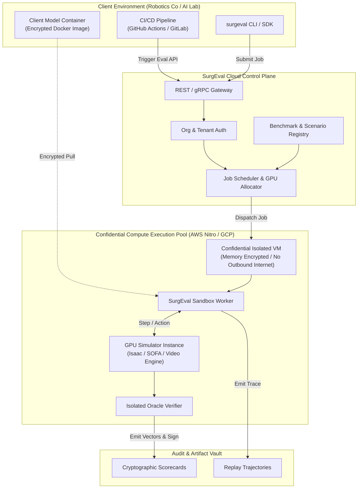

# SurgEval (Vector) Master Technical & Product Roadmap

**Universal Evaluation, Benchmarking & Safety Verification Platform for Physical Healthcare AI**

---

## 1. Executive Summary & Core Thesis

SurgEval (code-named `Vector`) is the universal evaluation, benchmarking, and safety verification platform for physical healthcare AI, surgical robotics, and procedural world models. 

### The Dual Role
1. **The Internal Engineering Engine:** Provides the high-fidelity simulation harness, safety gate verification, and regulatory evidence trail Seldinger needs to build autonomous endovascular robotics.
2. **The Commercial Platform:** Serves as the independent, neutral "Underwriters Laboratories (UL) for Surgical AI"—monetized as an open-core developer framework, a cloud execution platform, and enterprise regulatory safety attestation for the broader surgical and interventional robotics industry.

### The Scope
SurgEval is explicitly **multi-modal and procedure-agnostic**. It evaluates:
- **Surgical Video & Vision-Language Models (VLMs):** Laparoscopic, endoscopic, and open surgery (phase recognition, tool segmentation, Critical View of Safety identification, action anticipation).
- **Endoluminal & Robotic Bronchoscopy:** CT-guided airway navigation, peripheral pulmonary nodule targeting, and luminal wall contact force minimization.
- **Image-Guided Endovascular & Catheter Interventions:** Fluoroscopy, Digital Subtraction Angiography (DSA), 3D roadmapping, guidewire/catheter steering, and vascular wall safety.
- **Orthopedic & Rigid Robotic Surgery:** CT bone registration, robotic arm milling/burring trajectories, saw cut plane alignment, and haptic safety boundary enforcement.
- **Surgical World Models & Pre-Op Planners:** Counterfactual dynamics prediction, tissue deformation forecasting, complication risk ranking, and pre-operative procedural optimization.

---

## 2. System Architecture & 4-Layer Kernel

```
┌────────────────────────────────────────────────────────────────────────────────────────────────────────┐
│ Layer 4: Evidence, Regulatory & Commercialization Layer                                                │
│ • Scorecards (JSON, MD, HTML)  • Public Leaderboards (SurgBench)  • Multi-Surgeon Concordance (ICC)   │
│ • FDA Pre-Submission Dossier Generator  • Hardware-in-the-Loop (HIL) Physical Validation Attestation   │
├────────────────────────────────────────────────────────────────────────────────────────────────────────┤
│ Layer 3: Universal Interaction & Evaluator Kernel                                                      │
│ • InterfaceSpec <──> CapabilitySpec Schema Binding                                                     │
│ • 4 Harness Modes: single-turn | interactive | closed-loop | counterfactual                            │
│ • Inviolable Hard Safety Gates (cannot be averaged away into scalar rewards)                           │
│ • Deterministic ProceduralTrace & Canonical SHA-256 Content-Addressed Job Bundles                     │
├────────────────────────────────────────────────────────────────────────────────────────────────────────┤
│ Layer 2: Modality Adapters & Simulation Bridges                                                        │
│ • Video Stream Engine (Lap/Endo RGB-D)  • Volumetric CT / Airway Engine (Bronchoscopy)                │
│ • X-Ray / DSA / Contrast Flow Engine   • Physics Bridges: NVIDIA Isaac Lab / Warp, SOFA, PyBullet      │
├────────────────────────────────────────────────────────────────────────────────────────────────────────┤
│ Layer 1: Zero-Trust Sandboxed Execution Engine                                                         │
│ • Local Persistent Subprocess Protocol  • Docker / MicroVM Worker Fleet                                │
│ • Confidential Hardware Enclaves (AWS Nitro / GCP Confidential) for Zero-IP-Leakage Evaluation         │
└────────────────────────────────────────────────────────────────────────────────────────────────────────┘
```

---

## 3. Technical Roadmap: Phases 1 to 4

### Phase 1: The Multi-Modality Core Framework & Developer SDK (Months 1–3)

#### Goal
Expand the existing Vector v0.3 kernel from endovascular/synthetic tasks into a generalized, multi-modal procedural evaluation engine with a unified Python SDK.

```
┌────────────────────────────────────────────────────────────────────────────────────────────────────────┐
│ Phase 1 Deliverables                                                                                   │
├────────────────────────────────────────────────────────────────────────────────────────────────────────┤
│ 1. Modality Adapters: Video, Bronchoscopy/CT, Fluoroscopy, and Robotic Kinematics                     │
│ 2. Physics & Sim Connectors: SOFA Framework, NVIDIA Warp/Isaac Lab, and standard Gymnasium            │
│ 3. Universal Python SDK (`pip install surgeval`) with PyTorch, Hugging Face, and Ray RLlib bindings   │
│ 4. Generalized Safety Gate DSL: Spatial no-go zones, force thresholds, and anatomical boundaries       │
└────────────────────────────────────────────────────────────────────────────────────────────────────────┘
```

#### Module Architecture & Implementation Plan

```
src/or_audit/ (to be aliased/migrated to surgeval/)
├── eval/
│   ├── adapters/                  # NEW: Modality-specific data & sensor engines
│   │   ├── base.py                # BaseModalityAdapter interface
│   │   ├── video.py               # Frame streaming, temporal chunking, optical flow
│   │   ├── endoluminal.py         # CT airway trees, virtual camera, EM tracking
│   │   ├── fluoroscopy.py         # 2D X-ray projection, DSA contrast bolus, C-arm geometry
│   │   └── kinematics.py          # SE(3) robot tool poses, joint states, haptic boundaries
│   ├── sim/                       # NEW: Physics simulator bridges
│   │   ├── base.py                # SimulationEngine protocol (reset, step, render, inspect)
│   │   ├── gym_bridge.py          # Gymnasium standard wrapper (Lumen, MedGym)
│   │   ├── sofa_bridge.py         # SOFA Framework Cosserat rod / soft-tissue bridge
│   │   └── warp_bridge.py         # NVIDIA Warp / Isaac Lab GPU-accelerated mass rollouts
│   ├── contracts.py               # InterfaceSpec, CapabilitySpec, HarnessSpec, GateSpec
│   ├── runner.py                  # Multi-process orchestration (single-turn, closed-loop, etc.)
│   ├── verifier.py                # Isolated task verifiers & oracle scoring
│   ├── trace.py                   # ProceduralTrace, SafetyEventRecord, ToolEventRecord
│   ├── vector.py                  # TrialVector, GateOutcome, MetricOutcome, Projections
│   └── scorecard.py               # Aggregation, gate enforcement, multi-format renderers
└── sdk/                           # NEW: Public Python developer interface
    ├── __init__.py                # `import surgeval as se`
    ├── client.py                  # Local & remote evaluation orchestration
    ├── decorators.py              # `@se.agent`, `@se.task` decorators
    └── integrations/              # 1-line bindings for PyTorch, HF, Stable-Baselines3, Ray
```

#### Key Technical Contracts for Phase 1

1. **Modality Observation Types (`src/or_audit/eval/contracts.py`):**
   ```python
   class ModalityKind(StrEnum):
       VIDEO_LAPAROSCOPIC = "video-laparoscopic"
       VIDEO_ENDOSCOPIC = "video-endoscopic"
       AIRWAY_BRONCHOSCOPY = "airway-bronchoscopy"
       FLUOROSCOPY_DSA = "fluoroscopy-dsa"
       ORTHOPEDIC_POINTCLOUD = "orthopedic-pointcloud"
       ROBOTIC_KINEMATICS = "robotic-kinematics"
   ```

2. **Spatial & Biomechanical Safety Gate Definitions:**
   ```toml
   # Example: Laparoscopic Critical View of Safety Gate
   [[verifier.gates]]
   id = "no_go_structure_violation"
   kind = "spatial_exclusion"
   source = "oracle.instrument.distance_to_common_bile_duct"
   fail_when = "distance < 2.0" # mm
   maps_to = "critical_safety_violation"

   # Example: Bronchoscopy Wall Pressure Gate
   [[verifier.gates]]
   id = "airway_wall_perforation"
   kind = "force_threshold"
   source = "oracle.catheter.contact_force"
   fail_when = "contact_force > 1.5" # Newtons
   maps_to = "perforation_risk"
   ```

---

### Phase 2: "SurgBench" Flagship Benchmark Suites & Public Leaderboard (Months 4–6)

#### Goal
Create the "ImageNet / SWE-bench of Physical Healthcare AI"—curating 4 flagship benchmark suites across major procedural domains and launching a hosted public leaderboard with an interactive multi-modal web replay visualizer.

```
┌────────────────────────────────────────────────────────────────────────────────────────────────────────┐
│ Phase 2 Deliverables                                                                                   │
├────────────────────────────────────────────────────────────────────────────────────────────────────────┤
│ 1. 4 Flagship Benchmark Suites: Video, Bronchoscopy, Endovascular, Robotic Manipulation                │
│ 2. SurgBench Public Leaderboard (Hosted community evaluation for open foundation models)               │
│ 3. Multi-Modal Web Replay Hub: Interactive video, 3D tool paths, force traces, and safety gates        │
│ 4. Academic Partnership Program: Open-source benchmarks co-published with top academic surgical labs   │
└────────────────────────────────────────────────────────────────────────────────────────────────────────┘
```

#### The 4 Flagship Benchmark Suites

```
┌────────────────────────┬─────────────────────────┬─────────────────────────────────────────────────────┐
│ Benchmark Suite        │ Modality & Data Source  │ Evaluation Objective & Hard Safety Gates            │
├────────────────────────┼─────────────────────────┼─────────────────────────────────────────────────────┤
│ 1. SurgBench-Video     │ Laparoscopic &          │ • Phase recognition, tool segmentation, CVS         │
│                        │ Endoscopic Video        │ • Hard Gate: Critical structure misidentification   │
│                        │ (Cholec80, HeiChole,    │ • Hard Gate: Unsafe electrocautery trigger          │
│                        │  SAR-RARP50, Pituitary) │ • Metric: Anticipation lead time, mIoU, F1 score    │
├────────────────────────┼─────────────────────────┼─────────────────────────────────────────────────────┤
│ 2. SurgBench-Broncho   │ 3D CT Airways +         │ • Navigating peripheral airways to lung nodules     │
│                        │ Virtual Bronchoscopy    │ • Hard Gate: Airway wall puncture / force > 1.5 N   │
│                        │ (OpenAirway, Synthetic) │ • Hard Gate: Off-target biopsy trigger              │
│                        │                         │ • Metric: Target localization error, procedure time │
├────────────────────────┼─────────────────────────┼─────────────────────────────────────────────────────┤
│ 3. SurgBench-EndoNav   │ 2D Pulsed Fluoroscopy + │ • Navigating tortuous arches to MCA stroke occlusions│
│                        │ 3D Angiography (Lumen,  │ • Hard Gate: Vessel wall penetration / dissection   │
│                        │  AngioStress, 100 CTAs) │ • Hard Gate: Cumulative radiation area-dose limit   │
│                        │                         │ • Metric: Safe success rate, fluoroscopy time       │
├────────────────────────┼─────────────────────────┼─────────────────────────────────────────────────────┤
│ 4. SurgBench-Manip     │ dVRK / Robotic Arm      │ • Suturing, needle passing, peg transfer, retraction│
│                        │ Kinematics & Stereo RGB │ • Hard Gate: Excessive tissue traction force        │
│                        │ (Orbit-Surgical, SurRoL)│ • Hard Gate: Dropped needle / instrument collision  │
│                        │                         │ • Metric: Completion rate, trajectory smoothness    │
└────────────────────────┴─────────────────────────┴─────────────────────────────────────────────────────┘
```

#### Web Visualizer & Replay Hub Architecture (`site/`)
- **Multi-Panel Synchronized Playback:** Side-by-side synchronized view of laparoscopic video / fluoroscopy stream, 3D reconstructed anatomical mesh, instrument kinematic trajectory, and real-time sensor force curves.
- **Safety Violation Scrub Bar:** Temporal timeline highlighting exact timestamps where safety gates were breached (e.g., transient wall spikes, no-go zone proximity).
- **Cryptographic Artifact Inspector:** Inspect the complete `result.json`, `bundle.json`, SHA-256 tree digests, and command to replay locally via `surgeval replay <artifact-uri>`.

---

### Phase 3: Cloud Infrastructure, Distributed Workers & Confidential Computing (Months 7–9)

#### Goal
Build the commercial SaaS platform capable of orchestrating thousands of parallel evaluations across distributed GPU clusters with hardware-level confidentiality guarantees.

```
┌────────────────────────────────────────────────────────────────────────────────────────────────────────┐
│ Phase 3 Deliverables                                                                                   │
├────────────────────────────────────────────────────────────────────────────────────────────────────────┤
│ 1. Distributed Worker Fleet: Kubernetes / Ray cluster with GPU auto-scaling                           │
│ 2. Zero-Trust Confidential Enclaves: AWS Nitro Enclaves / GCP Confidential VM support                  │
│ 3. Developer Platform & CI/CD: GitHub Actions integration (`surgeval-action`) for PR safety gating     │
│ 4. Multi-Tenant Enterprise SaaS: Organization management, private benchmarks, custom compute queues   │
└────────────────────────────────────────────────────────────────────────────────────────────────────────┘
```



#### Confidential Computing & Zero-IP-Leakage Guarantee
Surgical robotics and medical device companies operate under extreme IP sensitivity. SurgEval solves this via **Confidential Execution**:
1. Customer submits a signed, encrypted container image containing their model weights.
2. The job runs in a dedicated Hardware Isolated Enclave (AWS Nitro Enclave or AMD SEV-SNP Confidential VM) with no external network access.
3. The simulator feeds observations into the container; the container returns actions.
4. Memory is encrypted at the hardware level with keys unavailable to SurgEval operators.
5. Upon completion, only the verified `scorecard.json`, trajectory vector, and cryptographic attestation signature are written out.
6. The container and memory state are permanently wiped.

---

### Phase 4: Regulatory Attestation Engine & Enterprise Expansion (Months 10–12)

#### Goal
Establish SurgEval as the "Underwriters Laboratories for Surgical AI"—generating FDA-ready Pre-Submission and De Novo safety verification dossiers and offering high-margin white-glove attestation.

```
┌────────────────────────────────────────────────────────────────────────────────────────────────────────┐
│ Phase 4 Deliverables                                                                                   │
├────────────────────────────────────────────────────────────────────────────────────────────────────────┤
│ 1. FDA Pre-Submission Dossier Generator: Automated ISO 13485 / IEC 62304 / GMLP compliance reporting │
│ 2. Clinical Concordance Panel: Multi-surgeon blinded scoring, inter-rater reliability (Fleiss' κ, ICC) │
│ 3. Hardware-in-the-Loop (HIL) Physical Validation Bridge: Silicone flow loops & robotic test benches   │
│ 4. Enterprise Attestation Service: Independent third-party safety certification for med-device OEMs   │
└────────────────────────────────────────────────────────────────────────────────────────────────────────┘
```

#### FDA-Ready Dossier Specification
The Regulatory Evidence Generator compiles formal technical documentation structured according to FDA guidance (*Marketing Submission Recommendations for AI/ML-Enabled Medical Devices* and *Guidance on Software as a Medical Device*):
- **Verification Protocol Definition:** Pre-registered, immutable task interfaces, evaluation seeds, and boundary conditions.
- **Inviolable Safety Matrix:** Quantitative proof that hard safety gates (perforation, tissue tearing, critical structure injury, radiation overdose) were never violated or smoothed over by reward averaging.
- **Outlier & Adversarial Stress Testing:** Performance evaluation across rare anatomical variants, sensor degradation, sudden hemorrhage/spasm, and optical occlusion.
- **Human Expert Concordance Attestation:** Inter-rater reliability analysis comparing the AI system's actions and predictions against a panel of certified surgeons:
  $$\text{ICC}(2,1) > 0.85, \quad \text{Fleiss' } \kappa > 0.80$$

---

## 4. Monetization & Business Model

```
┌─────────────────────────────────────────────────────────────────────────────────────────────────────────┐
│ Tier 1: Open-Core (Apache 2.0)                                                                          │
│ • Local CLI & Python SDK (`pip install surgeval`)                                                       │
│ • Standard task schemas, verification contracts, and reference toy environments                        │
│ • Public Leaderboards (SurgBench Arena)                                                                 │
│ ──> Target: Universal developer & academic adoption. Every research paper uses SurgEval metrics.        │
├─────────────────────────────────────────────────────────────────────────────────────────────────────────┤
│ Tier 2: Hosted Cloud SaaS ($2,500 – $10,000 / month / team + Compute Usage)                             │
│ • Parallel cloud GPU execution across hundreds of anatomical, video, and simulation registries          │
│ • Zero-Trust Confidential Hardware Enclaves (zero weight/data IP leakage)                               │
│ • Automated CI/CD GitHub Actions for robotic software regression testing                                │
│ • Private team workspaces and proprietary task registries                                               │
│ ──> Target: Surgical robotics startups, procedural AI companies, frontier medical AI labs.              │
├─────────────────────────────────────────────────────────────────────────────────────────────────────────┤
│ Tier 3: Regulatory Safety Attestation ($75,000 – $300,000 per audited model version)                    │
│ • Independent third-party safety certification prior to FDA 510(k) / De Novo / CE mark submissions      │
│ • Multi-surgeon expert panel clinical concordance verification                                          │
│ • Physical Hardware-in-the-Loop (HIL) flow-bench & phantom validation                                  │
│ • Comprehensive FDA-Ready Pre-Submission Safety Verification Dossier                                    │
│ ──> Target: Medical Device OEMs (Medtronic, Stryker, Intuitive, J&J, Siemens Healthineers, Philips).    │
└─────────────────────────────────────────────────────────────────────────────────────────────────────────┘
```

---

## 5. Risk Matrix & Mitigations

| Risk | Severity | Mitigation |
|---|---|---|
| **Sim-to-Real Gap Skepticism** | High | Pair every simulation benchmark with physical benchtop validation (HIL silicone flow loops, dVRK robot benches) and real-world retrospective video datasets. |
| **Model Weight IP Concerns** | Critical | Deploy Zero-Trust Confidential Computing (AWS Nitro / AMD SEV-SNP) where customer weights execute in hardware-encrypted enclaves with zero operator access. |
| **Simulator Fragmentation** | Medium | Maintain a clean abstraction layer (`BaseModalityAdapter` & `SimulationEngine`) supporting multiple backends (SOFA, Isaac Lab, PyBullet, custom renderers) rather than coupling to a single physics engine. |
| **Regulatory Shifts** | Medium | Align verification schemas directly with FDA AI/ML Pre-Determined Change Control Plan (PCCP) and Good Machine Learning Practice (GMLP) standards. |

---

## 6. How SurgEval Fuels Seldinger's Autonomous Endovascular Vision

```
                            ┌────────────────────────────────────────────────────────┐
                            │                    SURGEVAL PLATFORM                   │
                            │        (Broad Multi-Modal Evaluation Engine)           │
                            └──────────────────────────┬─────────────────────────────┘
                                                       │
                               ┌───────────────────────┴───────────────────────┐
                               │                                               │
                               ▼                                               ▼
                ┌─────────────────────────────┐                 ┌─────────────────────────────┐
                │     Commercial Engine       │                 │   Technical Acceleration    │
                │                             │                 │        for Seldinger        │
                ├─────────────────────────────┤                 ├─────────────────────────────┤
                │ • High-margin SaaS &        │                 │ • Battle-tested safety &    │
                │   attestation revenue       │                 │   verification kernel       │
                │ • Trusted partnerships with │                 │ • Standardized FDA evidence │
                │   Med-Device OEMs & FDA     │                 │   trail ready on Day 1      │
                │ • Industry standard status  │                 │ • Continuous benchmarking   │
                │   for surgical AI metrics   │                 │   against world SOTA        │
                └─────────────────────────────┘                 └─────────────────────────────┘
                                                                               │
                                                                               ▼
                                                                ┌─────────────────────────────┐
                                                                │  Autonomous Endovascular    │
                                                                │       Robotic Surgery       │
                                                                └─────────────────────────────┘
```

By building SurgEval as the universal evaluation and safety verification platform, Seldinger solves its own hardest validation and regulatory challenges while simultaneously establishing the commercial standard and infrastructure for the entire physical healthcare AI industry.
